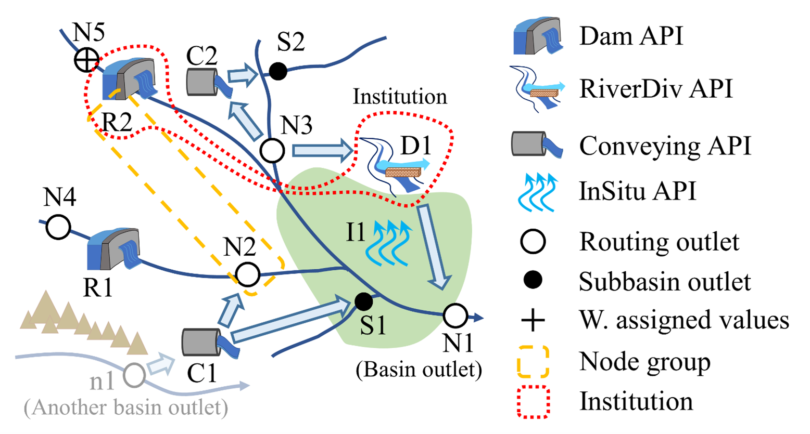

Introduction
============

The Hydrological model for Coupled Natural-Human Systems (HydroCNHS) is an open-source Python package supporting four Application Programming Interfaces (APIs) that enable users to integrate their human decision models, which can be programmed with the agent-based modeling (ABM) concept, into the HydroCNHS. 

When should you use HydroCNHS?
------------------------------
1.	Want to build a hydrological model with auto-parameter-tuning (calibration) features.
2.	Want to add human components into a hydrological model under a unified framework without worrying about routing logic.
3.	Want to calibrate the entire integrated model (hydrological + ABM modules) with customized agents' parameters.
4.	Want to design human behaviors with a high degree of freedom, including coupling with external software. 
5.	Want to conduct extensive numerical experiments to test various human behavioral designs (i.e., integrating and testing many ABM modules). 

Feature highlights
------------------
- Built-in genetic algorithm calibration module that can utilize parallel computing power.
- A unified framework allowing calibration of the entire integrated model (hydrological + ABM models), where parameters in the ABM module (i.e., human model) are customizable.
- Automatic integration and simulation through four APIs.
- Built-in data collector module that can collect data from the hydrological and user-defined ABM modules.
- Built-in model builder module to assist users in creating the HydroCNHS model and generating ABM module (*.py*) templates.
- Built-in indicator calculation and visualization tools for simple result analysis.

Supporting APIs for incorporating human/agent components
--------------------------------------------------------

Dam API
^^^^^^^
Link to human actions that completely redefine downstream flow, e.g., instream objects like reservoirs. The downstream flow is governed by a reservoir's operational rules and operators' decisions.

RiverDiv API
^^^^^^^^^^^^
Link to human actions that divert water from the river (with return water to the downstream subbasins), e.g., off-stream irrigation water diversions governed by farmers or regional district managers' diversion behaviors.

Conveying API
^^^^^^^^^^^^^
Link to human actions that convey water beyond basin boundaries and gravitational limitations, e.g., trans-basin aqueducts that convey water from one basin to another and pump stations that convey water from downstream to upstream.

InSitu API
^^^^^^^^^^
Link to human actions that locally alter the runoff in a subbasin, e.g., drainage systems, urbanization, and water diversion from wells or local streams (within-subbasin).

Those human/agent actions can be modeled with various complexities according to users' ABM design. Actions can simply be an inputted daily time series or governed by complex endogenous behavior rules (i.e., decision-making rules). Institutional decisions (a group of agents making decisions together with institutional rules) are allowed in HydroCNHS. Users require to have some level of object-oriented programing concept to design an ABM module (*.py*).