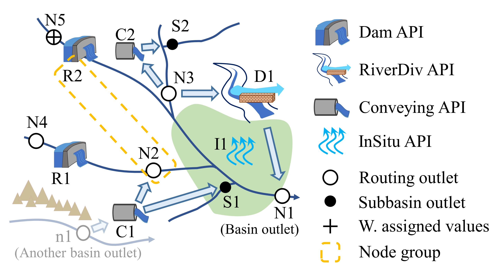

.. HydroCNHS documentation master file, created by
   sphinx-quickstart on Thu Dec 23 20:33:17 2021.
   You can adapt this file completely to your liking, but it should at least
   contain the root `toctree` directive.

HydroCNHS User Manual
=====================================

  A generic example of HydroCNHS coupling APIs and water system description. 
  Note agents, R1, R2, D1, C1, C2, and I1, are programmed in ABM modules (.py)
  and integrated into HydroCNHS through APIs.

.. toctree::
   :maxdepth: 2
   :caption: Contents:
   
   installation
   quickstart
   model_builder
   how_to_build_abm
   calibration
   ./source/HydroCNHS

Indices and tables
==================

* :ref:`genindex`
* :ref:`modindex`
* :ref:`search`
