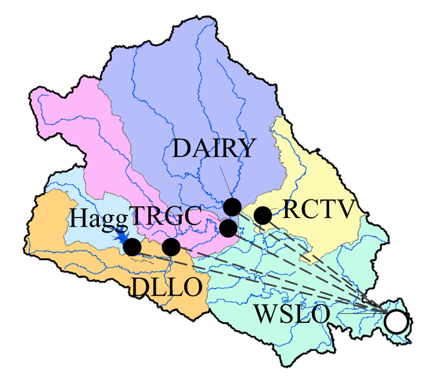

Build a hydrological model
==========================

To get familiar with the HydroCNHS model construction process, let's start with a hydrological model without human components. We will go through the following steps:

1.	Create a model configuration file (*.yaml*) using a model builder.

2.	Complete a model configuration file (*.yaml*)

3.	Run a calibration

4.	Run a simulation

We will adopt the following delineated watershed (:numref:`fig4`) as a demonstration, in which we want to build a semi-distributed hydrological model to simulate the streamflow at the basin outlet, WSLO. The corresponding subbasins' information is provided in :numref:`table4`.

.. _fig4:

  Example watershed.

.. _table4:
.. table:: Subbasins' information.
  :align: center
  :width: 100%

  +----------------+-------------------+---------------+-----------------------+
  |Subbasin/outlet |Drainage area [ha] |Latitude [deg] |Flow length to WSLO [m]|
  +================+===================+===============+=======================+
  |Hagg            |10034.2408         |45.469         |101469.139             |
  +----------------+-------------------+---------------+-----------------------+
  |DLLO            |22568.2404         |45.475         |91813.075              |
  +----------------+-------------------+---------------+-----------------------+
  |TRGC            |24044.6363         |45.502         |80064.864              |
  +----------------+-------------------+---------------+-----------------------+
  |DAIRY           |59822.7546         |45.520         |70988.164              |
  +----------------+-------------------+---------------+-----------------------+
  |RCTV            |19682.6046         |45.502         |60398.680              |
  +----------------+-------------------+---------------+-----------------------+
  |WSLO            |47646.8477         |45.350         |0                      |
  +----------------+-------------------+---------------+-----------------------+

Step 1: Create a model configuration file
-----------------------------------------

HydroCNHS comes with a model builder to help users create an initial model configuration file.

First, initiate a model builder object with a working directory (your working folder directory).

.. code-block:: python

    import os
    import hydrocnhs
    prj_path, this_filename = os.path.split(__file__)

Second, set up the water system with the simulation period (i.e., start date and end date).

.. code-block:: python

    wd = prj_path
    mb = hydrocnhs.ModelBuilder(wd)
    mb.set_water_system(start_date="1981/1/1", end_date="2013/12/31")

Third, we can add subbasins (i.e., outlet_list) into the model. We adopt the GWLF model as the rainfall-runoff model (i.e., runoff_model). We also assign the corresponding subbasins' areas (i.e., area_list) and latitude (i.e., lat_list) using the information from :numref:`table4`. Note that area_list and lat_list are optional arguments. Users can manually enter that information to the model configuration file (*.yaml*).

.. code-block:: python

    outlet_list = ['Hagg', 'DLLO', 'TRGC', 'DAIRY', 'RCTV', 'WSLO']
    area_list = [10034.2408, 22568.2404, 24044.6363, 59822.7546, 19682.6046,
                 47646.8477]
    lat_list = [45.469, 45.475, 45.502, 45.520, 45.502, 45.350]
    mb.set_rainfall_runoff(outlet_list=outlet_list,area_list=area_list,
                           lat_list=lat_list, runoff_model="GWLF")

Fourth, we want to add the routing setting. Here, we only have one routing outlet, WSLO, hence, we only need to run the following code once, and all the outlets are considered upstream outlets of WSLO.

.. code-block:: python

    flow_length_list = [101469.139, 91813.075, 80064.864, 70988.164, 60398.680, 0]
    mb.set_routing_outlet(routing_outlet="WSLO",
                          upstream_outlet_list=outlet_list,
                          flow_length_list=flow_length_list)

Finally, we can print out the model for quick view and then write it to *.yaml* file with the given name.

.. code-block:: python

    ### Print the model in the console
    mb.print_model()

    ### Output initial model configuration file (.yaml)
    mb.write_model_to_yaml(filename="HydroModel.yaml")

Now, we should have the initial model configuration file (i.e., *HydroModel.yaml*) in the corresponding folder.

Step 2: Complete a model configuration file
-------------------------------------------

Before using the created *HydroModel.yaml* for the later experiment, we need to open it and ensure the information is correct. The “Inputs” in LSM and Routing sections should be all populated. Some default values may be used (e.g., :math:`S0`, :math:`U0`, and :math:`SnowS`). They should be updated according to users' needs. For this example, we don't need to modify anything. You might notice that all the parameters have **a value of -99**. This is the default value in hydrocnhs, meaning that those values need to be calibrated if not provided by users.

Step 3: Run a calibration
-------------------------

First, we load the climate data, observed flow data at WSLO, and the model configuration file. Here, we have calculated the evapotranspiration using the Hamon method. Therefore, we load it as the inputs as well.

.. code-block:: python

    import matplotlib.pyplot as plt
    import pandas as pd
    import hydrocnhs.calibration as cali
    from copy import deepcopy

    # Load climate data
    temp = pd.read_csv(os.path.join(wd,"Data","Temp_degC.csv"),
                    index_col=["Date"]).to_dict(orient="list")
    prec = pd.read_csv(os.path.join(wd,"Data","Prec_cm.csv"),
                    index_col=["Date"]).to_dict(orient="list")
    pet = pd.read_csv(os.path.join(wd,"Data","Pet_cm.csv"),
                    index_col=["Date"]).to_dict(orient="list")

    # Load flow gauge monthly data at WSLO
    obv_flow_WSLO = pd.read_csv(os.path.join(wd,"Data","WSLO_M_cms.csv"),
                                index_col=["Date"], parse_dates=["Date"])

    # Load model
    model_dict = hydrocnhs.load_model(os.path.join(wd, "HydroModel.yaml"))

Second, we generate default parameter bounds and create a convertor for calibration. Details about the converter are provided in the Calibration section.

.. code-block:: python

    # Generate default parameter bounds
    df_list, df_name = hydrocnhs.write_model_to_df(model_dict)
    par_bound_df_list, df_name = hydrocnhs.gen_default_bounds(model_dict)

    # Create convertor for calibration
    converter = cali.Convertor()
    cali_inputs = converter.gen_cali_inputs(wd, df_list, par_bound_df_list)
    formatter = converter.formatter

Third, we program the evaluation function for a genetic algorithm (GA). Kling-Gupta efficiency (KGE; Gupta et al., 2009) is adopted to represent the model performance of simulated monthly streamflow at the WSLO routing outlet.

.. code-block:: python

    # Code evaluation function for GA algorthm
    def evaluation(individual, info):
        cali_wd, current_generation, ith_individual, formatter, _ = info
        name = "{}-{}".format(current_generation, ith_individual)

        ##### individual -> model
        # Convert 1D array to a list of dataframes.
        df_list = cali.Convertor.to_df_list(individual, formatter)
        # Feed dataframes in df_list to model dictionary.
        model = deepcopy(model_dict)
        for i, df in enumerate(df_list):
            s = df_name[i].split("_")[0]
            model = hydrocnhs.load_df_to_model_dict(model, df, s, "Pars")

        ##### Run simuluation
        model = hydrocnhs.Model(model, name)
        Q = model.run(temp, prec, pet)

        ##### Get simulation data
        # Streamflow of routing outlets.
        cali_target = ["WSLO"]
        cali_period = ("1981-1-1", "2005-12-31")
        sim_Q_D = pd.DataFrame(Q, index=model.pd_date_index)[cali_target]
        # Resample the daily simulation output to monthly outputs.
        sim_Q_M = sim_Q_D[cali_target].resample("MS").mean()

        KGE = hydrocnhs.Indicator().KGE(
            x_obv=obv_flow_WSLO[cali_period[0]:cali_period[1]][cali_target],
            y_sim=sim_Q_M[cali_period[0]:cali_period[1]][cali_target])

        fitness = KGE
        return (fitness,)

Forth, we set up a GA for calibration. Again, we will explain calibration in more detail in the Calibration section. Here, the code is demonstrated. Note that calibration might take some time to run, depending on your system specifications. Users can lower down 'pop_size ' and 'max_gen' if they just want to experience the process instead of seeking convergence. Note that to debug your code, please set 'paral_cores' to 1 to show the error messages.

.. code-block:: python

    config = {'min_or_max': 'max',
         'pop_size': 100,
         'num_ellite': 1,
         'prob_cross': 0.5,
         'prob_mut': 0.15,
         'stochastic': False,
         'max_gen': 100,
         'sampling_method': 'LHC',
         'drop_record': False,
         'paral_cores': -1,
         'paral_verbose': 1,
         'auto_save': True,
         'print_level': 1,
         'plot': True}

    seed = 5
    rn_gen = hydrocnhs.create_rn_gen(seed)
    ga = cali.GA_DEAP(evaluation, rn_gen)
    ga.set(cali_inputs, config, formatter, name="Cali_HydroModel_gwlf_KGE")
    ga.run()
    summary = ga.summary
    individual = ga.solution

Finally, we export the calibrated model (i.e., *Best_HydroModel_gwlf_KGE.yaml*).

.. code-block:: python

    ##### Output the calibrated model.
    df_list = cali.Convertor.to_df_list(individual, formatter)
    model_best = deepcopy(model_dict)
    for i, df in enumerate(df_list):
        s = df_name[i].split("_")[0]
        model = hydrocnhs.load_df_to_model_dict(model_best, df, s, "Pars")
    hydrocnhs.write_model(model_best, os.path.join(ga.cali_wd, "Best_HydroModel_gwlf_KGE.yaml"))

Step 4: Run a simulation
------------------------

After obtaining a calibrated model, users can now use it for any simulation-based experiment (e.g., streamflow uncertainty under climate change). The calibrated model configuration file (e.g., *Best_HydroModel_gwlf_KGE.yaml*) can be directly loaded into hydrocnhs to run a simulation.

.. code-block:: python

    ### Run a simulation.
    model = hydrocnhs.Model(os.path.join(wd, "Cali_HydroModel_gwlf_KGE",
                                        "Best_HydroModel_gwlf_KGE.yaml"))
    Q = model.run(temp, prec, pet)
    result = pd.DataFrame(Q, index=model.pd_date_index).resample("MS").mean()

    ### Plot
    fig, ax = plt.subplots()
    ax.plot(obv_flow_WSLO.index, obv_flow_WSLO.loc[:, "WSLO"], label="Obv")
    ax.plot(obv_flow_WSLO.index, result["WSLO"], ls="--", label="Sim")
    ax.legend()

The complete script can be found at *./tutorials/Hydro_example/Main_HydroModel.py*.

The following section will further introduce how to incorporate user-defined ABM modules into the model.
